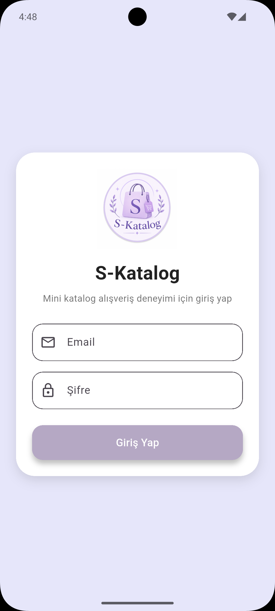
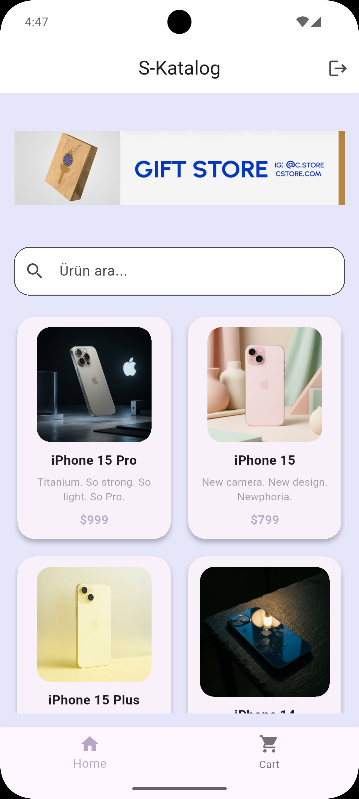
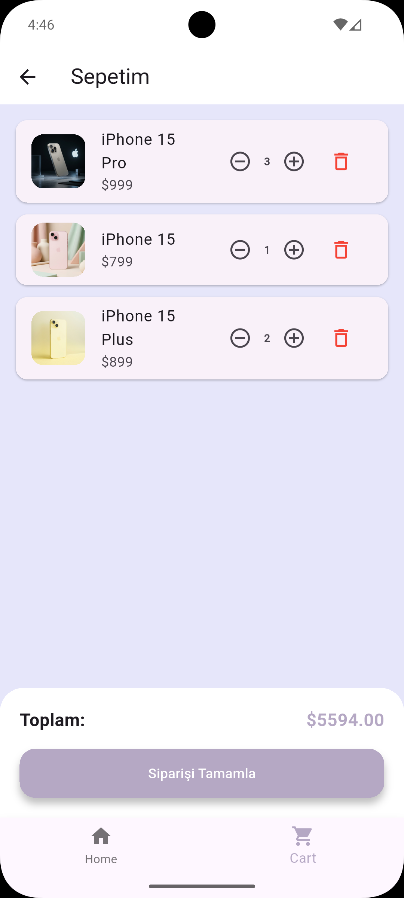

# S-Katalog 📱🛍️

S-Katalog, Flutter Günlük Eğitim Projesi kapsamında geliştirilmiş Flutter tabanlı bir mini katalog uygulamasıdır. Uygulama; UI tasarımı, API entegrasyonu, sayfa geçişleri (navigation), JSON işleme, yerel veri saklama ve sepet yönetimi gibi temel mobil geliştirme kavramlarını göstermektedir.

## Özellikler

- `Form` ve `GlobalKey` kullanılarak form doğrulamalı giriş ekranı
- `SharedPreferences` ile yerel giriş durumu yönetimi
- HTTP GET isteği kullanılarak WantAPI üzerinden ürün listeleme
- JSON verilerinin ayrıştırılması ve Dart model sınıfına dönüştürülmesi
- Temiz veri yönetimi için `ProductModel` yapısı
- API işlemleri için `ProductService` servis katmanı
- Yeniden kullanılabilir `ProductCard` ile component tabanlı UI yapısı
- Düzenli klasör yapısı: `models`, `services`, `views`, `components` ve `data`
- Banner, arama alanı ve ürün grid yapısına sahip Home sayfası
- Ürün adına göre arama ve filtreleme
- `Card`, `Container`, `Image.network` ve `GestureDetector` kullanılarak tasarlanan ürün kartları
- Görsel, başlık, tagline, açıklama ve fiyat bilgilerini içeren ürün detay sayfası
- `Navigator` kullanılarak Login, Home, Detail ve Cart sayfaları arasında geçiş
- Home ve Cart sayfaları arasında Bottom Navigation yapısı
- Global sepet verisi ile sepet simülasyonu
- Detail sayfasından sepete ürün ekleme
- Ürün görseli, adı, fiyatı ve adet bilgisini gösteren sepet ekranı
- `+ / -` butonları ile ürün adetini artırma ve azaltma
- Sepetten ürün silme işlemi
- Toplam fiyat hesaplama
- “Siparişi Tamamla” butonu ile sipariş simülasyonu
- API verileri yüklenirken Loading göstergesi
- Material Design bileşenleri kullanılarak oluşturulan modern pastel UI tasarımı
- Android ve iOS için özelleştirilmiş uygulama adı

## Kullanılan Teknolojiler

- Flutter SDK
- Dart
- Material Design
- HTTP package
- SharedPreferences
- Android Emulator
- Visual Studio Code (VS Code)

## Proje Yapısı

```text
lib/
│
components/
models/
services/
views/
data/
main.dart
```

## API Kaynakları

Ürün API’si:

https://wantapi.com/products.php

Banner görseli:

https://wantapi.com/assets/banner.png

## Ekran Görüntüleri

### Login Ekranı



### Home Ekranı



### Ürün Detay Ekranı


### Sepet Ekranı



## Kurulum

Repository klonlama:

```bash
git clone https://github.com/sinemtasdemir19/mini-katalog-app.git
```

Proje klasörünü açma:

```bash
cd mini_katalog_app
```

Paketleri yükleme:

```bash
flutter pub get
```

Uygulamayı çalıştırma:

```bash
flutter run
```

## Flutter Sürümü

Flutter: 3.41.9  
Dart: 3.11.5  
DevTools: 2.54.2

## Uygulama Adı

S-Katalog